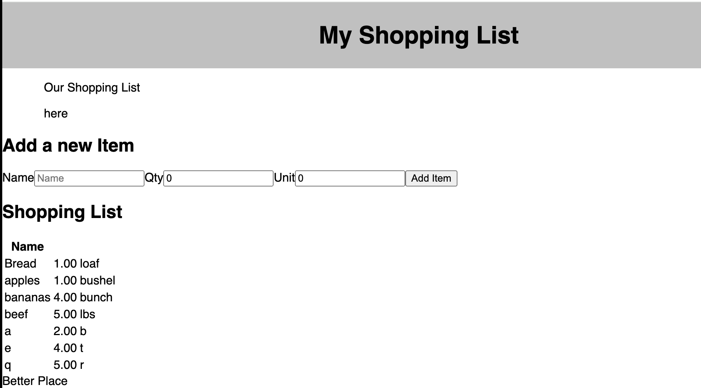

# React Shopping List

[Project Instructions](./INSTRUCTIONS.md), this line may be removed once you have updated the README.md

## Description

Duration: 3 Week Sprint

We have created a shopping list application that stores items in a database that can be built up over time.

## Features and Instructions

- All shopping list item components stored in database should appear when page first loads.
- Enter new item name, quantity and unit features in corresponding input fields.
- When 'Add Item' button is clicked:
    - Item and features show up on page under Shopping List
    - Item is added to and stored in database

# Screen Shot

## Prerequisites

- Node.js
- npm
- PostgreSQL

## Built With

- Visual Studio Code
- Material UI
- HTML
- CSS
- JS
- React
- Node.js
- Express
- POstgreSQL
- Postico
- Postman
- Github

## Acknowledgement

Thank you to Prime Digital Academy, especially Andrew, Chris and Carlos who taught and guided us to make this application a reality. Sincere thanks and appreciation to our Thu AM group development team Mel, Orion & Tracy - together we accomplish great things!

## Support

All suggestions are welcome! Please reach out via email with suggestions or questions to tmhsllc@icloud.com.